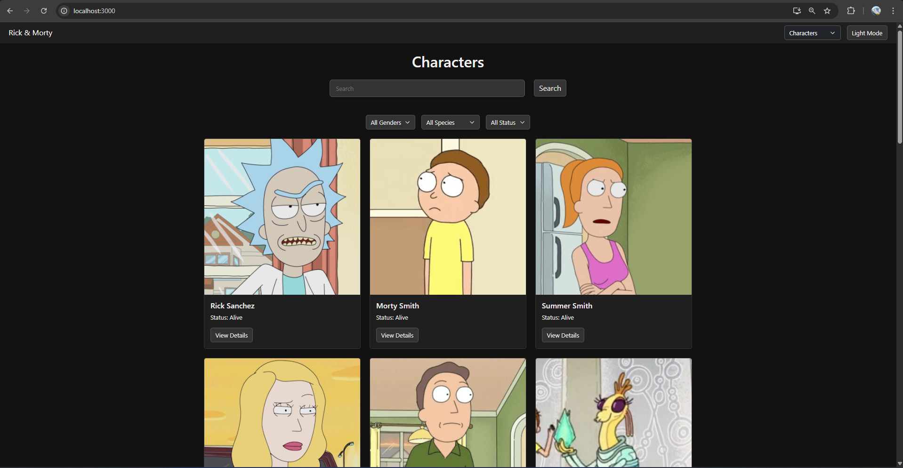
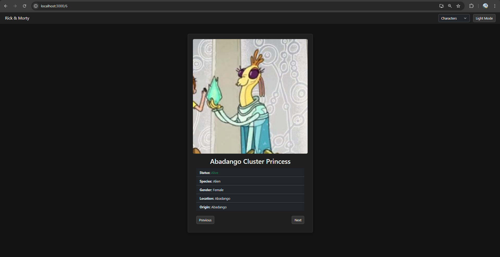
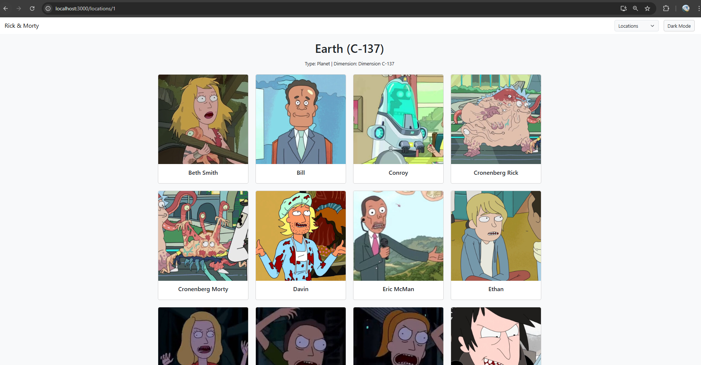

# Проект Рик и Морти

Проект в котором можно смотреть список персонажей, локации и эпизоды из мультсериала Рик и Морти, а также нажимать на них чтобы
получить более подробную информацию о них

## Запуск приложения

### `npm install`

Чтобы установить все необходимые файлы

### `npm start`

http://localhost:3000 - ссылка для запуска

чтобы запустить приложение, также должен быть запущен бэкэнд. Ссылка на мой бэкэнд - https://github.com/aidarinho2017/RickAndMortyBackend

## ссылка на деплоенный сайт: https://rickmortynfactorial.netlify.app/

## Скриншоты

## Описание процесса

Сначала был разработан бэкэнд на Go. Я создал модели для хранения персонажей, эпизодов и локаций, которые я брал
с https://rickandmortyapi.com. Затем я написал 6 эндпоинтов которые фронтенд должен брать, но фронтенд не видел 
эти данные, поэтому я добавил еще CORS middleware. Фронтенд я написал на React, а для дизайна я использовал
классы с Bootstrap, что очень быстро и удобно. Во фронтенде я сделал светлую и темную темы через шаблон bootstrap.
Были сделаны фильтрация, поиск и пагинация для удобного просмотра.

### Как пользоваться

В навигации можно переключиться на персонажей, эпизоды или локации. Перед вами
появится список из них. При нажатии появится более подробная информация, если нажать 
на персонажа, то можно увидеть страницу с полной информацией о нем

